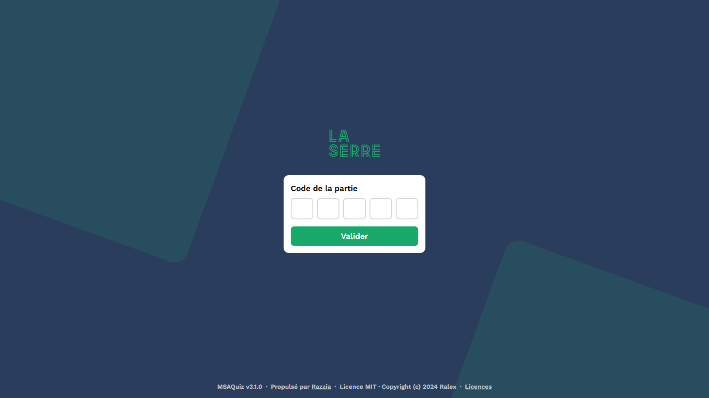
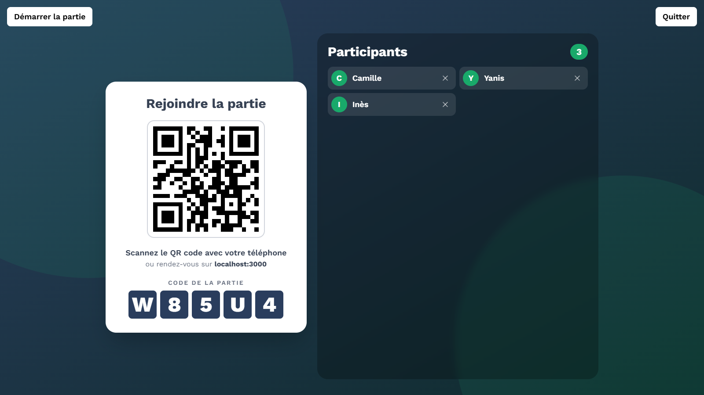
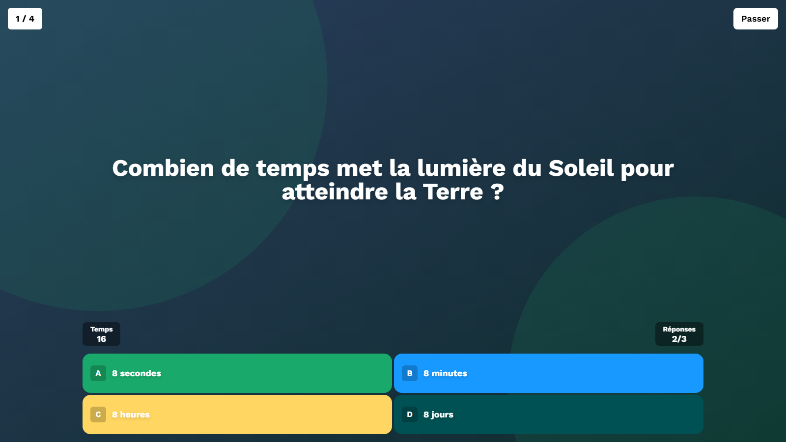

<h1 align="center">MSAQuiz</h1>
<p align="center"><strong>La plateforme de quiz interne d'iMSA</strong> — self-hosted, temps réel, aux couleurs de La Serre.</p>

## 🧩 What is this project?

MSAQuiz is iMSA's internal quiz platform: create quizzes, host live games, and collect results — self-hosted on our own infrastructure. It is built on top of [Razzia](https://github.com/Ralex91/Razzia), an open-source quiz platform by Ralex91.

> **Disclaimer**: Neither MSAQuiz nor Razzia, the open-source project it is built on, is affiliated with, endorsed by or sponsored by any third-party quiz platform or service.

<p align="center">
  
  
  
</p>

## 🍴 About this fork (MSAQuiz)

This repository is **iMSA's soft-fork of [Razzia](https://github.com/Ralex91/Razzia)**, deployed internally as **MSAQuiz**.

**Fork policy:** we track upstream as a read-only remote and **cherry-pick** the fixes/features we want, on our own schedule — no rebase of our branches on upstream, no upstream PRs required.

```bash
git fetch upstream                          # remote: https://github.com/Ralex91/Razzia.git
git log --oneline HEAD..upstream/dev        # see what's new upstream
git cherry-pick <sha>                       # pick only what we want
```

**Differences vs upstream:**

- **SQLite persistence** — quizzes and game results live in a database (`config/msaquiz.db`), not in JSON files. Schema is ready for user accounts (Microsoft SSO planned).
- **Excel import** — import quizzes from `.xlsx` spreadsheets.
- **Excel export** — download any game result as an `.xlsx` report.
- **Poll, true/false & info-slide question types** — in addition to upstream's single/multi.
- **Per-question statistics** — success rates aggregated across every game of a quizz.
- The footer displays the branded app name (from `config/branding`).

The default look follows the La Serre brand guidelines (logo, palette, Work Sans, background). The deployment volume (`config/branding/`) can still override any of it.

> Note: internal package names (`@razzia/web`, `@razzia/socket`, `@razzia/common`) are kept as-is on purpose — renaming them would create massive, pointless divergence from upstream.

## ⚙️ Prerequisites

Choose one of the following deployment methods:

### Without Docker

- Node.js : version 22 or higher
- PNPM : version 10.16 or higher (learn more [here](https://pnpm.io/))

### With Docker

- Docker and Docker Compose

## 📖 Getting Started

Choose your deployment method:

### 🐳 Using Docker (Recommended)

The image is built from this repository (there is no public MSAQuiz image). Using Docker Compose (recommended — see [compose.yml](/compose.yml)):

```bash
docker compose up -d --build
```

Or using Docker directly:

```bash
docker build -t msaquiz .
docker run -d \
  -p 3000:3000 \
  -v ./config:/app/config \
  msaquiz
```

**Configuration Volume:**
The `-v ./config:/app/config` option mounts a local `config` folder to persist your game settings and quizzes. This allows you to:

- Edit your configuration files directly on your host machine
- Keep your settings when updating the container
- Easily backup your quizzes and game configuration

The folder will be created automatically on first run with an example quiz to get you started.

The application will be available at http://localhost:3000

**Corporate network (TLS-intercepting proxy):**
If the build fails with `TLS: server certificate not trusted` (apk) or `unable to get local issuer certificate` (npm/pnpm), export the proxy's root certificate in PEM format (Base-64) into `docker/certs/` (e.g. `docker/certs/corporate-root-ca.crt`), then rebuild. Files in that folder are gitignored.

**Development with hot reload:**
[compose.dev.yml](/compose.dev.yml) runs the dev servers instead of the production build: the repository is mounted into the container, Vite reloads the front-end and the socket server restarts on every file change.

```bash
docker compose -f compose.dev.yml up --build
```

It uses port 3000 too, so stop the production container first (`docker compose down`); stop the dev one with `docker compose -f compose.dev.yml down`. Don't run `pnpm dev` on the host at the same time either: both would open `config/msaquiz.db`, and the container fails with `SqliteError: disk I/O error` (`SQLITE_IOERR_SHMOPEN`).

Dependencies live in Docker volumes and are re-synced from `pnpm-lock.yaml` at startup, so after pulling a lockfile change just restart the container. To add a dependency, update the lockfile through the container first, then restart:

```bash
docker compose -f compose.dev.yml run --rm msaquiz-dev pnpm add <package> --filter @razzia/web
```

### 🛠️ Without Docker

1. Clone the repository:

```bash
git clone https://github.com/iMSA-La-serre/MSAQuiz.git
cd ./MSAQuiz
```

2. Install dependencies:

```bash
pnpm install
```

3. Build and start the application:

```bash
# Development mode
pnpm run dev

# Production mode
pnpm run build
pnpm start
```

## ⚙️ Configuration

The configuration is split into two main parts:

### 1. Game Configuration (`config/game.json`)

Main game settings:

```json
{
  "managerPassword": "PASSWORD"
}
```

Options:

- `managerPassword`: The master password for accessing the manager interface. **Must be changed from the default `"PASSWORD"` value**, otherwise manager access is blocked.

### 2. Database (`config/msaquiz.db`)

Quizzes and game results are stored in a **SQLite database** located in the config volume (`config/msaquiz.db`). It is created and migrated **automatically at startup** (WAL mode) — nothing to install or configure.

- **Backup**: backing up the `config/` folder covers everything (database included).
- **Legacy note**: `config/quizz/*.json` files are **no longer read** at runtime. To recover old quizzes, import them once via the manager (Quizz → Import, JSON format). Old `config/results/*.json` files are not migrated (no import path — they stay readable on disk).
- Schema changes are managed with Drizzle migrations (`packages/socket/src/db/`): `pnpm --filter @razzia/socket run db:generate` after editing `schema.ts`.

### 3. Creating & importing quizzes

Quizzes can be created three ways, all from the manager dashboard:

- **Quiz Editor** (recommended) — full editor with media, timers and question types.
- **JSON import** — a file matching the format below.
- **Excel import (`.xlsx`)** — reads quiz spreadsheets, including those exported from Kahoot! or built from its quiz template: a header row containing `Question`, `Answer 1..4`, `Time limit`, `Correct answer(s)` (1-based, comma-separated), data on the following rows — or the fixed template layout (columns B–H, data from row 9). Questions with several correct answers become multi-select (strict scoring).

> **Trademark note**: Kahoot! is a trademark of its owner, which is not affiliated with MSAQuiz and does not endorse or sponsor it. The name is only used to say which spreadsheet files the importer can read.

The JSON format, the fourteen question types (`single`, `multi`, `truefalse`, `poll`, `slide`, `ordering`, `shortanswer`, `wordcloud`, `estimate`, `highlight`, `statements`, `categorize`, `ranking`, `scale`), the scoring modes and the spreadsheet import rules are documented in **[docs/quiz.md](docs/quiz.md)**.

### 4. Game results

Results are saved automatically at the end of each game and browsable in the manager (Résultats tab). Each result can be **downloaded as an Excel report** (ranking sheet + per-question answer distribution, and a participation sheet for the word clouds, whose words are never linked to a player).

The **Stats tab** aggregates every game of a quizz: success rate per question, hardest questions first, how many players let the timer run out, and which answers were picked. Questions are matched by their text, so editing or reordering a quizz keeps its history readable. Only games played after this feature landed are linked to their quizz — older results stay in the Résultats tab but carry no link, so they are not counted.

### 5. Custom branding (`config/branding/`) — optional

You can fully rebrand the app **without touching the code** by dropping files into a `config/branding/` folder. If it is absent, the default look is used.

Create `config/branding/theme.json`:

```json
{
  "appName": "My Quiz",
  "colors": { "primary": "#1d4ed8", "secondary": "#0f172a" },
  "answerColors": ["#e69f00", "#56b4e9", "#3dbfa0", "#cc79a7"],
  "font": {
    "family": "Rubik",
    "url": "https://fonts.googleapis.com/css2?family=Rubik:wght@300..900&display=swap"
  },
  "logo": "/branding/logo.svg",
  "favicon": "/branding/favicon.svg",
  "background": "/branding/background.png"
}
```

All fields are optional — anything you omit keeps its default value.

- `appName`: app name + browser tab title
- `colors`: CSS color tokens (at least `primary` and `secondary`)
- `answerColors`: up to 4 answer-button colors
- `font`: a font family + an optional stylesheet URL (e.g. Google Fonts)
- `logo` / `favicon` / `background`: drop the files in `config/branding/` and reference them here

## 🎮 How to Play

1. Access the manager interface at http://localhost:3000/manager
2. Enter the manager password (defined in `config/game.json`)
3. Share the game URL (http://localhost:3000) and room code with participants
4. Wait for players to join
5. Click the start button to begin the game

## 🚀 Deploying a new version (iMSA)

1. **Build the image from this repo** (the Dockerfile handles the SQLite native module, the DB migrations and the web build):

   ```bash
   docker build -t <registry>/msaquiz:latest .
   docker push <registry>/msaquiz:latest
   ```

2. **On the VM**: `docker compose pull && docker compose up -d` (or `up -d --build` if building on the VM).

3. **The config volume does the rest** — nothing else to install:
   - `config/msaquiz.db` is created and migrated automatically at startup;
   - `config/branding/` (La Serre theme) is untouched by deployments;
   - `config/game.json` (manager password) is preserved.

4. **First deployment of the DB version only**: quizzes previously stored as `config/quizz/*.json` are no longer read — re-import the ones you care about via the manager (Quizz → Import, JSON).

## 📝 Contributing

MSAQuiz is maintained internally by the La Serre team — open issues and pull requests on [iMSA-La-serre/MSAQuiz](https://github.com/iMSA-La-serre/MSAQuiz).

### Tests

Automated tests run with [Vitest](https://vitest.dev):

```bash
pnpm test        # once, as CI does
pnpm test:watch  # while developing
```

They cover the pure logic — quiz validation, the scoring of every question type, the point curves and the spreadsheet import parser — and run on every pull request. Test files sit next to the code they cover (`*.test.ts`).

Keep them away from the database: importing anything that reaches `repositories/` or `db/` opens SQLite as a side effect, so stub those modules instead (see `packages/socket/src/utils/game.test.ts`).

## 🙏 Credits

Built on [Razzia](https://github.com/Ralex91/Razzia) by [Ralex91](https://github.com/Ralex91) — our generic runtime-theming system was contributed back upstream (PR #127).
