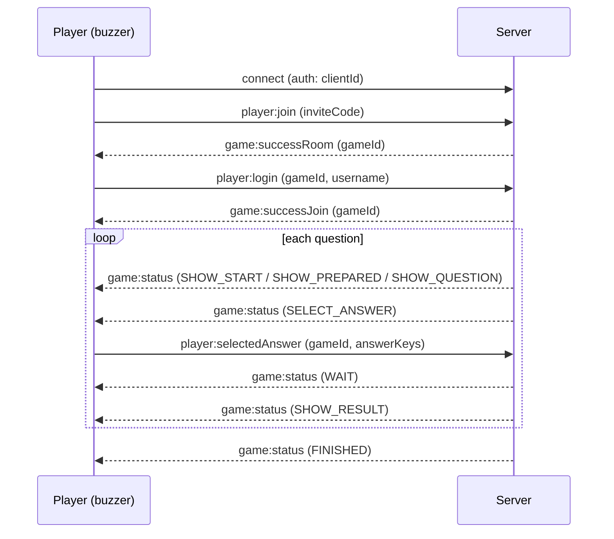
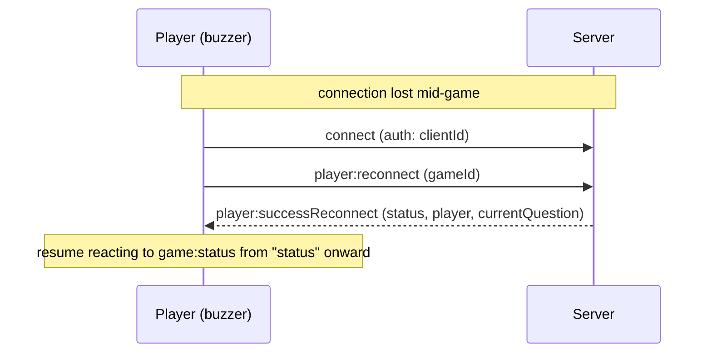

# WebSocket protocol

MSAQuiz's client-server communication runs entirely over [Socket.IO](https://socket.io/), on the `/ws` path. This document describes the **player-facing** part of the protocol, so you can build an alternative client, for example firmware for an ESP32-based physical buzzer for kids, instead of using the web UI.

> This protocol is internal and not version-stabilized. It can change between releases without a deprecation period. Check this file against the version you deploy.

## Connecting

```js
io("http://<host>:<port>", {
  path: "/ws",
  auth: { clientId },
})
```

- `clientId` is a stable, random identifier your device generates once and persists (e.g. in flash on an ESP32). It's what lets a player rejoin their seat in the game after a disconnect (Wi-Fi drop, reboot, etc). Reusing the same `clientId` after a disconnect triggers the reconnect flow instead of creating a new player.
- There's no HTTP auth for players. Anyone who knows a 5-character game code can join a room, so treat the game code as a room key.
- The server doesn't override Socket.IO's default keepalive (`pingInterval` 25s / `pingTimeout` 20s). Your client library needs to answer Engine.IO pings within that window or it will be dropped as disconnected.

## Message envelope

Most client -> server events take a plain payload. Events tied to an active game take an object with a `gameId` and, for a few of them, a nested `data`:

```ts
{ gameId: string, data: { ... } }
```

Server -> client game state updates arrive on a single event, `game:status`, shaped as:

```ts
{ name: Status, data: StatusDataMap[Status] }
```

where `name` is one of the status constants below and `data` is the payload for that specific status.

## Joining a game as a player

1. **Check the game code** (optional, used by the web UI to validate a saved code before offering to rejoin):

   ```
   emit  player:checkCode        <inviteCode: string>
   on    player:checkCodeResult  { valid: boolean }
   ```

   The code is 5 characters from `ABCDFGHJKMNPQRSTUVWXYZ23456789`: no look-alikes such as `0`/`O` or `1`/`I`/`L`, and no `E`, which URL search-param parsing could read as an exponent. Case and surrounding spaces are ignored.

2. **Enter the room**:

   ```
   emit player:join <inviteCode: string>
   ```

   - `on game:successRoom <gameId: string>`: the invite code is valid and this `clientId` hasn't joined yet. Proceed to step 3.
   - If this `clientId` already joined this game before (e.g. after a reconnect), the server reconnects the player automatically instead and emits `player:successReconnect` (see [Reconnecting](#reconnecting)).
   - `on game:errorMessage <key: string>`: invalid/unknown invite code, or you are the manager's `clientId` trying to join your own game.

3. **Pick a username** (only after receiving `gameId` from step 2):

   ```
   emit player:login { gameId, data: { username } }
   ```

   - `username` must be 1-20 characters ([validators/auth.ts](../packages/common/src/validators/auth.ts)).
   - `on game:successJoin <gameId: string>`: you're in. The server also emits `manager:newPlayer` to the manager and `game:totalPlayers <count>` to everyone in the room.
   - `on game:errorMessage <key: string>`: invalid username, or this `clientId` already has a player in the game.

From here, wait for `game:status` events and react to the `name` field.

## Game status flow

The manager drives the game through a fixed sequence of statuses, broadcast to every player via `game:status`. A single button/buzzer client mainly cares about `SELECT_ANSWER` (when it should accept a button press) and `SHOW_RESULT` (whether that press was correct).

| Status          | Player payload (`data`)                                                                                                                                                                                                                                                                   | What it means                                                                                                                                                                                                                                                                                                                                                                                                                                                                                                                                                                                                                                                                                                                                                                                                                                                                                                                                                                                                                                                                                                                                                                                                                                                                                                                                                                                                                                                                   |
| --------------- | ----------------------------------------------------------------------------------------------------------------------------------------------------------------------------------------------------------------------------------------------------------------------------------------- | ------------------------------------------------------------------------------------------------------------------------------------------------------------------------------------------------------------------------------------------------------------------------------------------------------------------------------------------------------------------------------------------------------------------------------------------------------------------------------------------------------------------------------------------------------------------------------------------------------------------------------------------------------------------------------------------------------------------------------------------------------------------------------------------------------------------------------------------------------------------------------------------------------------------------------------------------------------------------------------------------------------------------------------------------------------------------------------------------------------------------------------------------------------------------------------------------------------------------------------------------------------------------------------------------------------------------------------------------------------------------------------------------------------------------------------------------------------------------------- |
| `SHOW_START`    | `{ time: number, subject: string }`                                                                                                                                                                                                                                                       | Countdown before the quiz starts.                                                                                                                                                                                                                                                                                                                                                                                                                                                                                                                                                                                                                                                                                                                                                                                                                                                                                                                                                                                                                                                                                                                                                                                                                                                                                                                                                                                                                                               |
| `SHOW_PREPARED` | `{ totalAnswers: number, questionNumber: number, questionType: "single" \| "multi" \| "truefalse" \| "poll" \| "slide" \| "ordering" \| "shortanswer" \| "wordcloud" \| "estimate" \| "highlight" \| "statements" \| "categorize" }`                                                      | Short transition before a question is shown: its number, its type, and how many answer options it has (the length of the `answers` list to come: 0 for a `"shortanswer"`, a `"wordcloud"` or an `"estimate"`, the number of passages for a `"highlight"`, the number of items for `"statements"` and a `"categorize"`).                                                                                                                                                                                                                                                                                                                                                                                                                                                                                                                                                                                                                                                                                                                                                                                                                                                                                                                                                                                                                                                                                                                                                         |
| `SHOW_QUESTION` | `{ question: string, media?, upcomingMedia?: "video" \| "audio", cooldown: number, answers: string[], questionType, time: number, totalPlayer: number, options?, text?, targets? }`                                                                                                       | Reading time: the question and its answers are shown, but answers are **not** accepted yet (the server ignores a submission sent now). `cooldown` is how many seconds until answers open. `media` is only an image at this step; `upcomingMedia` announces a video or audio that starts with `SELECT_ANSWER`. `answers` is the same list as in `SELECT_ANSWER`: shuffled for an `"ordering"`, empty for a `"shortanswer"`, a `"wordcloud"` or an `"estimate"`. `options`, `text` and `targets` are the same as in `SELECT_ANSWER`, so the answer area can be laid out already (the fields of a `"wordcloud"`, the unit and bounds of an `"estimate"`, the text of a `"highlight"`, the targets of `"statements"` and a `"categorize"`). The solutions, the accepted answers of a `"shortanswer"`, the right value of an `"estimate"`, the correct order of an `"ordering"` and the right targets of `"statements"` and a `"categorize"` are never sent to players.                                                                                                                                                                                                                                                                                                                                                                                                                                                                                                              |
| `SELECT_ANSWER` | `{ question, answers: string[], media?, time: number, totalPlayer: number, questionType: "single" \| "multi" \| "truefalse" \| "poll" \| "slide" \| "ordering" \| "shortanswer" \| "wordcloud" \| "estimate" \| "highlight" \| "statements" \| "categorize", options?, text?, targets? }` | Answers are open. `answers.length` tells you how many buttons are relevant (2-4, none for a slide). `time` is the number of seconds to answer. `questionType` is `"single"` (one correct button), `"multi"` (one or more), `"truefalse"` (two buttons, one correct), `"poll"` (a vote, no correct button), `"slide"` (an info screen, nothing to submit, `answers` is empty), `"ordering"` (3 to 6 items to put in order, `answers` is the shuffled list, the same for every player and after a reconnection) `"shortanswer"` (a text to type, `answers` is empty), `"wordcloud"` (1 to `options.wordCount` words to type, 1 when absent, `answers` is empty) `"estimate"` (a number to type, `answers` is empty; `options` gives its `decimals`, `min`, `max`, `unit`, `tolerance` and `toleranceMode`) or `"highlight"` (a short `text` whose 2 to 5 passages between `[brackets]` are `answers`, in the order of the text: tap one or more; `parseHighlight` in [utils/highlight.ts](../packages/common/src/utils/highlight.ts) splits the text the way the web phone does), `"statements"` (2 to 5 statements in `answers`, each true or false: `targets` is `["Vrai", "Faux"]`) or `"categorize"` (2 to 5 elements in `answers`, each to sort into one of the 2 to 4 categories of `targets`).                                                                                                                                                                             |
| `SHOW_RESULT`   | `{ outcome: "correct" \| "partial" \| "wrong" \| "noAnswer" \| "voted" \| "noVote", correct: boolean, message: string, points: number, myPoints: number, rank: number, totalPlayers: number }`                                                                                            | How the question ended for you. `outcome` is `"correct"`, `"wrong"` or `"noAnswer"` on a scored question, `"voted"` or `"noVote"` on a `"poll"` or a `"wordcloud"`; an `"ordering"` can also end `"partial"` (some items at their place, not all), and so can a `"highlight"` (some credit from its scoring mode, not all), `"statements"` and a `"categorize"` (some items matched with their right target, not all). `correct` keeps its meaning: whether your answer earned credit (true for `"partial"` too), or on a `"poll"` or a `"wordcloud"` only that your answer was recorded. `message` is the matching i18n key: `game:correct`, `game:partial`, `game:wrong`, `game:noAnswer`, `game:pollAnswered` or `game:pollNoVote`; a `"wordcloud"` sends `game:wordcloudAnswered` for `"voted"` and `game:noAnswer` for `"noVote"`. `points` is the change actually applied to your total this question (negative for a penalty, after the floor at 0), `myPoints` your new total, `rank` your position out of `totalPlayers`. On a `"partial"` ordering only, `placed: { count, total }` gives how many items you put at their place; on a `"partial"` highlight only, `found: { count, total, extra }` gives how many passages to spot you tapped, out of how many, and how many other passages you tapped; on `"partial"` statements or categorize only, `matched: { count, total }` gives how many items you matched with their right target. Not sent for a `"slide"`. |
| `WAIT`          | `{ text: string }`                                                                                                                                                                                                                                                                        | Generic waiting screen (e.g. after answering, waiting for other players or for the manager to continue).                                                                                                                                                                                                                                                                                                                                                                                                                                                                                                                                                                                                                                                                                                                                                                                                                                                                                                                                                                                                                                                                                                                                                                                                                                                                                                                                                                        |
| `FINISHED`      | `{ subject: string, top: { id, username, points, correctInARow, connected }[], rank?: number, totalPlayers?: number }`                                                                                                                                                                    | Game over: the top 5 of the final leaderboard, and for a player their final `rank` out of `totalPlayers`. The entries carry no `clientId`.                                                                                                                                                                                                                                                                                                                                                                                                                                                                                                                                                                                                                                                                                                                                                                                                                                                                                                                                                                                                                                                                                                                                                                                                                                                                                                                                      |

> **Breaking change:** `SHOW_RESULT` no longer carries `aheadOfMe` (the name of the player ranked just above you). A button or buzzer client that reads it must stop; use `rank` and `totalPlayers` instead. On the manager side, `SHOW_LEADERBOARD` no longer sends `oldLeaderboard`, and each leaderboard entry carries `gain`, the points won or lost on the last question.

> **Breaking change:** the `top` entries of `FINISHED` no longer carry `clientId` (the identifier that lets a device take a seat back on reconnect), nor the per-round fields of the leaderboard: only `id`, `username`, `points`, `correctInARow` and `connected`.

Other useful events while a game is in progress:

- `on game:updateQuestion { current: number, total: number }`: question index changed.
- `on game:totalPlayers <count: number>`: number of players in the room changed.
- `on game:reset <key: string>`: the session is no longer valid (manager left before start, you were kicked, game expired, etc). Treat this as "go back to the join screen."

## Submitting an answer

Only valid while the current status is `SELECT_ANSWER`. The server silently ignores a submission sent before (during `SHOW_QUESTION`, even though the answers are already on screen) or after the answer window (once the question has closed), and only the **first** submission per question counts, submitting again is silently ignored too:

```
emit player:selectedAnswer { gameId, data: { answerKeys: number[] } }
emit player:selectedAnswer { gameId, data: { text: string } }
emit player:selectedAnswer { gameId, data: { texts: string[] } }
```

`data` holds one of `answerKeys`, `text` or `texts`, never two of them; anything else is dropped.

- `answerKeys` are 0-based indices into the `answers` array received in `SELECT_ANSWER`. For a `"single"` question, send a one-element array, e.g. `[1]` for the second button. For `"multi"`, send every button pressed, e.g. `[0, 2]`, and for a `"highlight"` every passage tapped, at least one. For `"poll"`, send the single button voted for: no answer is correct, so no points are awarded. A `"slide"` takes no submission at all.
- For an `"ordering"`, `answerKeys` lists every index of the shuffled `answers` list exactly once, in the order the player chose: with `answers` `["C", "A", "B"]`, the order A, B, C is `[1, 2, 0]`. A list that is not such a permutation (missing, repeated or unknown index) is ignored.
- For `"statements"` and a `"categorize"`, `answerKeys` gives a target for every item, in the order of `answers`: the index of the target in `targets`, repeats allowed. With three statements, Vrai, Faux, Vrai is `[0, 1, 0]`. A list of another length, or with an unknown target, is ignored.
- For a `"shortanswer"`, send `{ text }`, at most 200 characters. The server cleans it (Unicode NFKC, invisible characters removed, spaces collapsed and trimmed) and ignores it when it is then empty or longer than 60 characters; `countInputChars` in [utils/text.ts](../packages/common/src/utils/text.ts) counts the way the server does.
- For a `"wordcloud"`, send `{ texts }`: 1 to `options.wordCount` texts (3 at most), 200 characters at most each. Each one is cleaned as a `"shortanswer"` input and must then hold 1 to 30 characters, or the whole submission is ignored. A text that repeats another one once compared (case, accents and punctuation ignored), and a text the moderation refuses (swear words, insults, e-mail addresses, links, phone numbers), are dropped without notice: the submission still counts as an answer, even with no word left. The server never links the words to the player: once the question closes, it only keeps that the player answered.
- For an `"estimate"`, send `{ text }` too: the number, at most 200 characters, in French or English notation (`1 234,5` or `1234.5`). The server reads it as the web phone does (spaces dropped, one comma or point before the decimals, a leading sign) and ignores it when it is no number, has more decimals than `options.decimals` (0 when absent), or is out of `options.min` and `options.max`; `checkEstimate` in [utils/estimate.ts](../packages/common/src/utils/estimate.ts) reads it the way the server does. The answer is right when it is within the tolerance of the right value, bounds included.
- Points are time-weighted (faster correct answers score higher), computed server-side from `time` and when you answer relative to the start of the answer window. When `time` is `-1` (no limit), points depend on answer order instead. A question can switch this speed bonus off (`speedBonus`, off by default for `"ordering"`, `"shortanswer"`, `"estimate"`, `"highlight"`, `"statements"` and `"categorize"`): every right answer then earns the full points.
- After submitting, expect `data: { text: "game:waitingForAnswers" }` on the `WAIT` status, then `SHOW_RESULT` once the question closes (time runs out or every player has answered).

This is the one event a 4-button ESP32 buzzer needs to send: map each physical button to an answer index and emit this event on press, once, while in `SELECT_ANSWER`.

## Reconnecting

If the socket disconnects (`disconnect` event fires implicitly, no action needed client-side) and reconnects, replay the same `clientId` and call:

```
emit player:reconnect { gameId }
```

- `on player:successReconnect { gameId, status, player: { username, points }, currentQuestion }`: you're back in, `status` is the current `game:status` payload so you can resume the UI where it left off (for an `"ordering"`, with the same shuffled list). An answer submitted before the drop still counts, and a second one for the same question is ignored.
- `on game:reset <key: string>`: the game no longer exists or this player slot is already connected elsewhere, start over from [Joining a game](#joining-a-game-as-a-player).

You need to persist `gameId` and `clientId` across reconnects/reboots to use this (e.g. in the ESP32's NVS flash) — a fresh `gameId` is only handed out by `game:successRoom` / `game:successJoin` when first joining.

## Leaving a game

An unexpected drop (Wi-Fi loss, reboot) is handled by the server as a temporary disconnect: no event needed, just reconnect later with the same `clientId` as above.

If the player intentionally quits (e.g. a physical "leave" button), emit this instead so the manager sees them go immediately rather than just "disconnected":

```
emit player:leave { gameId }
```

Before the game has started this removes you from the player list entirely; once started, it behaves the same as a disconnect (marked disconnected, seat kept for a potential reconnect).

## Full example

A minimal buzzer runs this sequence once, then just reacts to `game:status` until it sees `SELECT_ANSWER`:



If the socket drops mid-game (Wi-Fi loss, reboot) and comes back, replay the persisted `clientId` and `gameId` instead of joining again:



## Reference: all player-relevant events

Full type definitions live in [packages/common/src/types/game/socket.ts](../packages/common/src/types/game/socket.ts) and the constants (exact string values) in [packages/common/src/constants.ts](../packages/common/src/constants.ts).

**Client → Server**

| Event                   | Payload                                                                                 |
| ----------------------- | --------------------------------------------------------------------------------------- |
| `player:checkCode`      | `inviteCode: string`                                                                    |
| `player:join`           | `inviteCode: string`                                                                    |
| `player:login`          | `{ gameId, data: { username: string } }`                                                |
| `player:reconnect`      | `{ gameId: string }`                                                                    |
| `player:leave`          | `{ gameId: string }`                                                                    |
| `player:selectedAnswer` | `{ gameId, data: { answerKeys: number[] } \| { text: string } \| { texts: string[] } }` |

**Server → Client**

| Event                     | Payload                                            |
| ------------------------- | -------------------------------------------------- |
| `player:checkCodeResult`  | `{ valid: boolean }`                               |
| `player:successReconnect` | `{ gameId, status, player, currentQuestion }`      |
| `game:status`             | `{ name: Status, data }`                           |
| `game:successRoom`        | `gameId: string`                                   |
| `game:successJoin`        | `gameId: string`                                   |
| `game:totalPlayers`       | `count: number`                                    |
| `game:updateQuestion`     | `{ current: number, total: number }`               |
| `game:playerAnswer`       | `count: number` (players who have answered so far) |
| `game:errorMessage`       | `key: string`                                      |
| `game:reset`              | `key: string`                                      |

`key`/`message` string values here are i18n translation keys used by the web UI (e.g. `errors:game.notFound`), not human-readable text — treat them as symbolic error codes and map the ones you care about.

The manager side of the protocol (creating games, starting rounds, kicking players, quiz CRUD) is out of scope for a buzzer client; see [packages/socket/src/handlers](../packages/socket/src/handlers) if you need it.

## Manager: question results

Once a question closes, only the manager receives `SHOW_RESPONSES`: the question itself (with `solutions`, `accepted` for a `"shortanswer"`, `expected` and `options` for an `"estimate"`, `text` for a `"highlight"`, `targets` and `expectedTargets` for `"statements"` and a `"categorize"`) plus these fields.

| Field           | Meaning                                                                                                                                                                                                                                                                                                                                                                                                                                  |
| --------------- | ---------------------------------------------------------------------------------------------------------------------------------------------------------------------------------------------------------------------------------------------------------------------------------------------------------------------------------------------------------------------------------------------------------------------------------------- |
| `responses`     | Counts keyed by index. Choice types: votes per answer (a `"highlight"`: players who tapped each passage). `"ordering"`: players who put item `i` at its place, `i` indexing `answers`, which is in the correct order here. `"statements"` and `"categorize"`: players who matched item `i` with its right target. `"shortanswer"`: inputs recognized per accepted answer.                                                                |
| `totalAnswered` | Players who submitted an answer, recognized or not.                                                                                                                                                                                                                                                                                                                                                                                      |
| `totalPlayers`  | Players in the game.                                                                                                                                                                                                                                                                                                                                                                                                                     |
| `correctCount`  | Scored types only: answers with full credit.                                                                                                                                                                                                                                                                                                                                                                                             |
| `partialCount`  | Scored types only: answers with some credit, not all (an `"ordering"`, `"statements"` or a `"categorize"` partly right, a `"multi"` or a `"highlight"` in a partial mode).                                                                                                                                                                                                                                                               |
| `words`         | `"wordcloud"` only: the 30 most frequent words, `{ text, count }`, the most frequent first; words given as often follow an order drawn from each word and the wording of the question, unrelated to the order the answers came in. Words are counted once compared (case, accents and punctuation ignored) and shown in the form typed most often. `distinctWords` counts every different word kept, shown or not. `responses` is empty. |
| `ranges`        | `"estimate"` only: the numbers sent, counted by range around the right value, the smallest first: `{ from, to, count, correct }`, `from` and `to` included, `null` for an open end, `correct` on the range within the tolerance. `median` is the median of the numbers sent, `null` without any. `responses` is empty.                                                                                                                   |
| `publicOrder`   | `"ordering"` only: the shuffled list players were shown, as indices into `answers` (`publicOrder[i]` is the item shown at position `i`), so the manager's screen letters each item as the phones did.                                                                                                                                                                                                                                    |

On a `"shortanswer"`, the inputs that matched no accepted answer are `totalAnswered - correctCount`; `SHOW_RESPONSES` never carries the texts players typed. On an `"estimate"`, it carries the counts by range, not who sent which number. On a `"wordcloud"`, `words` never says who typed a word.
